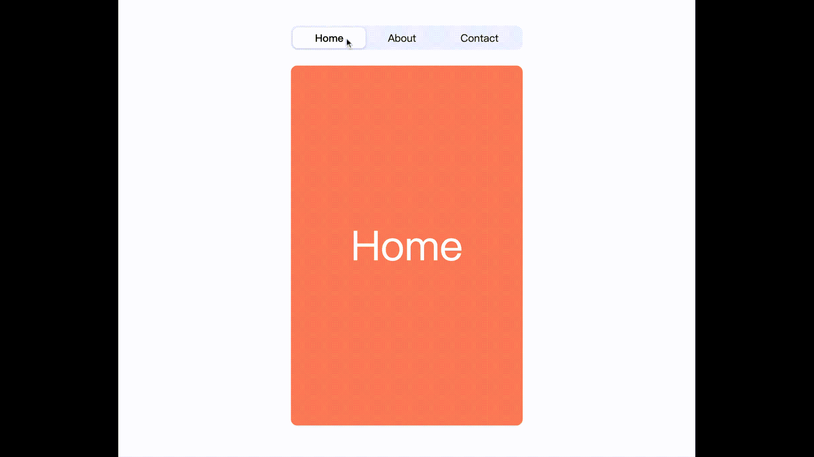

# react-slide-routes 🏄‍♂️

The easiest way to slide React routes

[](https://www.npmjs.com/package/react-slide-routes)
[](https://www.npmtrends.com/react-slide-routes)
[](https://bundlephobia.com/result?p=react-slide-routes)
[](https://github.com/facebook/react)
[](https://github.com/remix-run/react-router/tree/main/packages/react-router-dom)
[](https://github.com/nanxiaobei/react-slide-routes/blob/main/LICENSE)

## Fit

React Router v6

> For React Router v5, please use [`react-slide-routes@1.1.0`](https://github.com/nanxiaobei/react-slide-routes/blob/367ff0dfa94c9ff3234fc55493c27e3a53996ccd/README.md) and note that the usage is different.

## Add

```shell script
yarn add react-slide-routes

# or

npm i react-slide-routes
```

## Use

```jsx
import { Route } from 'react-router-dom';
import SlideRoutes from 'react-slide-routes';

const App = () => (
  <SlideRoutes>
    <Route path="/" element={<Home />} />
    <Route path="/about" element={<About />} />
    <Route path="/contact" element={<Contact />} />
  </SlideRoutes>
);
```

## Live

[Play a live demo here → 🤳](https://codesandbox.io/s/react-slide-routes-bnzlu)



## API

| Prop        | Type       | Required | Default   | Description                                                                                                                                                                                                                       |
| ----------- | ---------- | -------- | --------- | --------------------------------------------------------------------------------------------------------------------------------------------------------------------------------------------------------------------------------- |
| `animation` | `string`   |          | `'slide'` | Animation effect type, `'slide'`, `'vertical-slide'`, or `'rotate'`                                                                                                                                                               |
| `duration`  | `number`   |          | `200`     | `transition-duration` in `ms`                                                                                                                                                                                                     |
| `timing`    | `string`   |          | `'ease'`  | `transition-timing-function`, one of `'ease'` `'ease-in'` `'ease-out'` `'ease-in-out'` `'linear'`                                                                                                                                 |
| `destroy`   | `boolean`  |          | `true`    | If `false`, prev page will still exits in dom, just invisible                                                                                                                                                                     |
| `compare`   | `function` |          | -         | Function to sort the routes' order (defaults to the definition order). `compare` will be used to `routes.sort((a, b) => compare(a, b))`, `routes` is the param to [`useRoutes`](https://reactrouter.com/en/main/hooks/use-routes) |

## License

[MIT License](https://github.com/nanxiaobei/react-slide-routes/blob/main/LICENSE) © [nanxiaobei](https://lee.so/)

## FUTAKE

If you use WeChat, please try "**FUTAKE**". It's a WeChat mini app for your inspiration moments. 🌈


